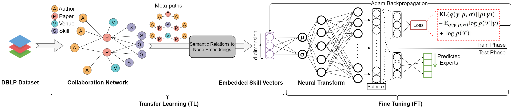
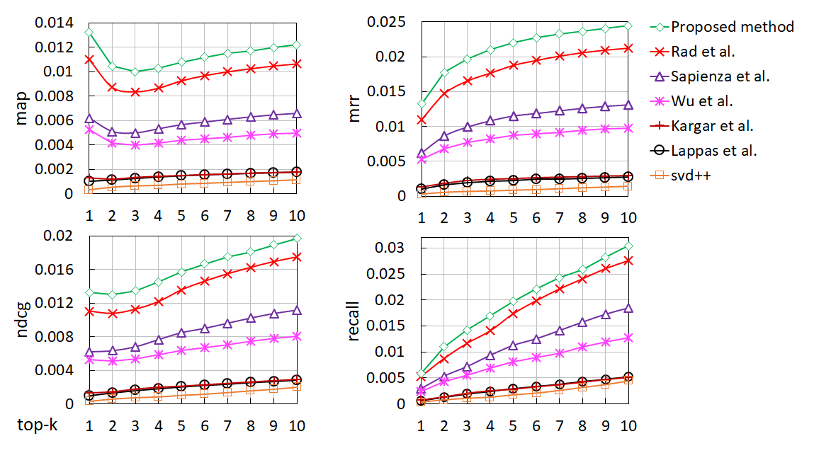
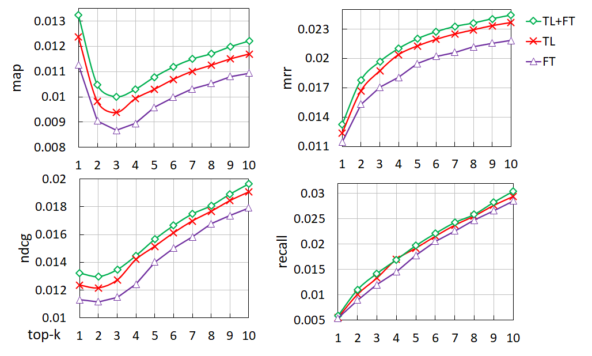
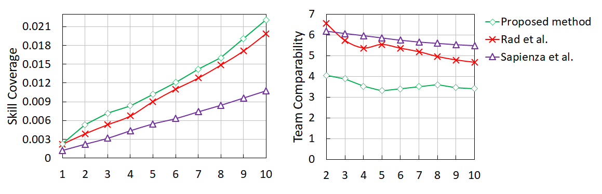
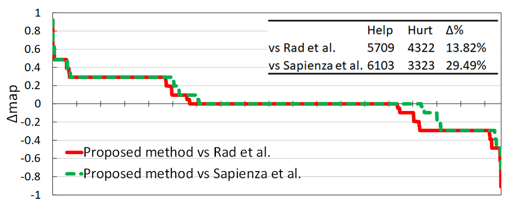

[](https://jupyter.org/try) [](https://www.python.org/) [](http://ansicolortags.readthedocs.io/?badge=latest)

# Retrieving Skill Based Teams from Collaboration Networks 


Given a set of required skills, the objective of the team formation problem is to form a team of experts that cover the required skills. Most existing approaches are based on graph methods, such as minimum-cost spanning trees. These approaches, due to their limited view of the network, fail to capture complex interactions among experts and are computationally intractable. More recent approaches adopt neural architectures to learn a mapping between the skills and experts space. While they are more effective, these techniques face two main limitations: (1) they consider a fixed representation for both skills and experts, and (2) they overlook the significant amount of past collaboration network information. We learn dense representations for skills and experts based on previous collaborations and bootstrap the training process through transfer learning. We also propose to fine-tune the representation of skills and experts while learning the mapping function. Our experiments over the DBLP dataset verify that our proposed architecture is able to outperform the state-of-the-art graph and neural methods over both ranking and quality metrics.

## Installation

You need to install the following libraries using pip or conda command before running the codes:

```
Python 3+
Tensorflow V1.X
Keras
Stellargraph 
Joblib
Gensim
Tqdm
```

## Dataset

Dataset used in this pepr can be found in [Aminer website](https://lfs.aminer.cn/lab-datasets/citation/dblp.v8.tgz). You need to download the dataset before running the codes. After downloading the dataset,extract it into the [dataset directory](https://github.com/DoubleBlind-Repo/Retrieving-Skill-Based-Teams-from-Collaboration-Networks/tree/main/dataset). However, the preprocessed dataset is already exist in dataset folder and codes can use them without any furthur steps. The authors of each paper are considered to represent a team, and the specializations required for the paper are its skill sets. For extracting skills from the raw data, after stop word removal and stemming, we identify the top-2,000 unigram, bigram and trigrams of the phrases with the highest tf-idf scores from the paper titles to represent the set of skills. We construct the heterogeneous collaboration network from the DBLP dataset by considering the authors, papers, skills, and venues as the nodes of the network. The edges of the collaboration network represent associations between author-paper, paper-skill and paper-venue node pairs.

## Usage Instructions

1. Preprocessing

	The DBLP dataset needs to be converted to the heterogeneous graph in order to generate the embeddings. You can do that by running the **"preprocess_AMiner.ipynb"** notebook in [trainsfer_kearning/dblp](https://github.com/DoubleBlind-Repo/Retrieving-Skill-Based-Teams-from-Collaboration-Networks/tree/main/transfer_learning/dblp) directory.

2. Transfer Learning

	After preparing the dataset, use **"run_DBLP_mp2v.ipynb"** Jupyter notebook inside the [transfer_learning](https://github.com/DoubleBlind-Repo/Retrieving-Skill-Based-Teams-from-Collaboration-Networks/tree/main/transfer_learning) folder to generate embedding files needed for the fine tuning part.

3. Fine Tuning

	This parts will train and fine-tune our proposed neural network based on generated embeddings. Before running the model, the generated embedding file must be moved from [transfer_learning/model_save_dir/DBLP](https://github.com/DoubleBlind-Repo/Retrieving-Skill-Based-Teams-from-Collaboration-Networks/tree/main/transfer_learning/model_save_dir/DBLP) to the [dataset](https://github.com/DoubleBlind-Repo/Retrieving-Skill-Based-Teams-from-Collaboration-Networks/tree/main/dataset) folder. You can then simply run the **"model.py"** in [fine_tuning](https://github.com/DoubleBlind-Repo/Retrieving-Skill-Based-Teams-from-Collaboration-Networks/tree/main/fine_tuning) folder by using this command in terminal:
	
     `python model.py`

	* Take note that parameters are initilized at the beggining of the code and can be changed for experiments.


## Evaluating the results

Predictions can be evaluated using the codes provided in eval folder. All the reported numbers/charts can be reproduced by running the **"comparison.py"** python file in [eval](https://github.com/DoubleBlind-Repo/Retrieving-Skill-Based-Teams-from-Collaboration-Networks/tree/main/eval) directory.
For each of the methods, an individual csv file will be generated respectively. You can modify list of evaluating methods in the **"comparison.py"** file under the "file_names" variable. Please take note that for each of the methods, their prediction output file must be avaialble in the [predictions](https://github.com/DoubleBlind-Repo/Retrieving-Skill-Based-Teams-from-Collaboration-Networks/tree/main/output/predictions) folder under the output directory. Comparison file will generate following IR-related metrics for the desired **k**:

1. Coverage @k
2. NDCG @k
3. MAP @k
4. MRR @k

Here are plots for the calculated metrics:

<p align="center"> </p>


Also, two qualitative metrics scores that reported in the paper also will be generated by running the **"comparison.py"** file. The output numbers can then be used for the visualization.

<p align="center"></p>

Numbers required for the Help-Hurt diagram are generated using by **"HelpHurt.py"** file in [eval](https://github.com/DoubleBlind-Repo/Retrieving-Skill-Based-Teams-from-Collaboration-Networks/tree/main/eval) directory. After running the file, a csv file will be available in ["eval_results"](https://github.com/DoubleBlind-Repo/Retrieving-Skill-Based-Teams-from-Collaboration-Networks/tree/main/output/eval_results) folder under output directoy.
You can then use the results in csv file to plot the diagram. For example:

<p align="center"></p>


## Contributing
You can use this reference format to cite our work:
```
@inproceedings{10.1145/3404835.3463105,
author = {Hamidi Rad, Radin and Bagheri, Ebrahim and Kargar, Mehdi and Srivastava, Divesh and Szlichta, Jaroslaw},
title = {Retrieving Skill-Based Teams from Collaboration Networks},
year = {2021},
isbn = {9781450380379},
publisher = {Association for Computing Machinery},
address = {New York, NY, USA},
url = {https://doi.org/10.1145/3404835.3463105},
doi = {10.1145/3404835.3463105},
booktitle = {Proceedings of the 44th International ACM SIGIR Conference on Research and Development in Information Retrieval},
pages = {2015–2019},
numpages = {5},
keywords = {expert networks, team formation, task assignment},
location = {Virtual Event, Canada},
series = {SIGIR '21}
}
```

